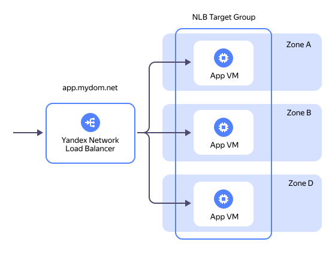
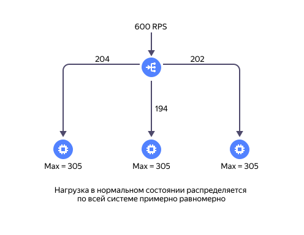
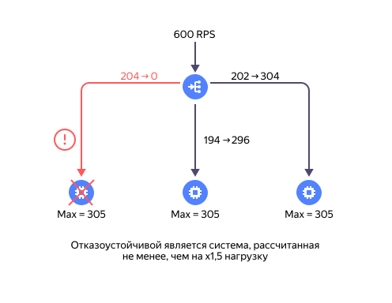

# Развёртывание отказоустойчивого Web-приложения в Yandex Cloud с помощью сетевого балансировщика нагрузки (NLB)

Оглавление:
* [Введение](#overview)
* [Принципы балансировки NLB](#theory)
* [Развёртывание Web-приложения](#deploy)
* [Результаты развёртывания Web-приложения](#artifacts)
* [Тестирование отказоустойчивости Web-приложения с помощью SG](#sg)
* [Тестирование отказоустойчивости Web-приложения с помощью iptables](#ipt)
* [Удаление развертывания](#uninstall)

## Введение <a id="overview"/></a>

При развертывании отказоустойчивых приложений рекомендуется использовать балансировщики нагрузки. В Yandex Cloud балансировщики нагрузки являются ключевыми элементами, позволяющими снижать или полностью исключать влияние отказов в инфраструктуре на работу приложений.

В Yandex Cloud есть два типа балансировщиков сетевого трафика:
* [Сетевой балансировщик нагрузки](https://yandex.cloud/docs/network-load-balancer/concepts) (Network Load Balancer, `NLB`). Обеспечивает балансировку на 4-ом уровне сетевой модели OSI.
* [Балансировщик нагрузки уровня приложений или L7-балансировщик](https://yandex.cloud/docs/application-load-balancer/concepts) (Application Load Balancer, `ALB`). Обеспечивает балансировку на 7-ом уровне сетевой модели OSI, в основном работает с протоколами `HTTP` и `HTTPS`.

Подробнее ознакомиться с описанием балансировщиков нагрузки можно в документации, по ссылкам которые приведены выше.

В данном решении показано развертывание Web-приложения в отказоустойчивой конфигурации с помощью [сетевого балансировщика нагрузки](https://yandex.cloud/docs/network-load-balancer/concepts).

## Принципы балансировки NLB <a id="theory"/></a>

Сетевой балансировщик нагрузки `NLB` состоит из двух основных частей:
* [Обработчик трафика](https://yandex.cloud/docs/network-load-balancer/concepts/listener) (`Listener`):
    * принимает трафик от клиентов приложения.
    * распределяет принятый трафик в группы целевых ресурсов. При распределении трафика используется алгоритм [5-tuple hash](https://yandex.cloud/docs/network-load-balancer/concepts/specifics#nlb-flows). Трафик распределяется только к целевым ресурсам, которые находятся [в рабочем состоянии](https://yandex.cloud/docs/network-load-balancer/concepts/health-check).
* [Группы целевых ресурсов](https://yandex.cloud/docs/network-load-balancer/concepts/target-resources) (Target Group, `TG`). Под `ресурсом` здесь понимается IP-адрес сетевого интерфейса виртуальной машины, которая будет обрабатывать распределяемый балансировщиком трафик. У балансировщика может быть одна или несколько групп ресурсов.

Представим себе Web-приложение, которое развернуто в Yandex Cloud в трёх [зонах доступности](https://yandex.cloud/docs/overview/concepts/geo-scope):

<p align="left">
    
</p>

В нормальном состоянии `NLB` будет распределять входящий трафик к Web-приложению по целевым ресурсам в группе примерно равномерно. Неравномерность распределения связана с особенностями работы алгоритма распределения [5-tuple hash](https://yandex.cloud/docs/network-load-balancer/concepts/specifics#nlb-flows).

<p align="center">
    
</p>

При отказе в одной из зон доступности, [механизм проверки состояния целевых ресурсов](https://yandex.cloud/docs/network-load-balancer/concepts/health-check) `NLB` обнаружит потерю ресурса в отказавшей зоне и переключит входящий трафик к приложению на доступные целевые ресурсы в других зонах доступности.

<p align="center">
    
</p>

Для работы в отказоустойчивом режиме каждый из целевых ресурсов приложения должен иметь запас по мощности для обработки дополнительной нагрузки при возможных отказах.


## Развертывание Web-приложения <a id="deploy"/></a>

Развёртывание Web-приложения в Yandex Cloud предполагается из ОС `Linux` или `MacOS`.

0. Перед началом развертывания необходимо убедиться, что необходимые инструменты установлены и настроены:
* `yc CLI` - [установлен](https://yandex.cloud/docs/cli/operations/install-cli) и [настроен](https://yandex.cloud/docs/cli/operations/profile/profile-create#create)
* `Terraform` - [установлен](https://yandex.cloud/docs/tutorials/infrastructure-management/terraform-quickstart#install-terraform) и [настроен](https://yandex.cloud/docs/tutorials/infrastructure-management/terraform-quickstart#configure-provider)

1. Загрузить развёртывание из репозитория на [github.com](https://github.com/yandex-cloud-examples/yc-deploy-ha-app-with-nlb):
    ```bash
    git clone https://github.com/yandex-cloud-examples/yc-deploy-ha-app-with-nlb.git
    ```

2. Перейти в папку с развёртыванием:
    ```bash
    cd yc-deploy-ha-app-with-nlb
    ```

3. Заполнить значения переменных в файле [terraform.tfvars](./terraform.tfvars). Краткое описание входных переменных:
* `zone_list` - список зон доступности в которых будет разворачиваться Web-приложение, а также префиксов IP-подсетей для каждой из зон. Рекомендуется использовать не менее двух зон доступности при развёртывании.
* `app_name` - имя приложения, например, `app`. Используется для генерации Let's Encrypt (LE) сертификата.
* `app_fqdn` - FQDN имя приложения, например, `app.mydom.net`. Используется для генерации LE сертификата.
* `user_name` - имя пользователя - администратора для подключения по SSH к виртуальным машинам с Web-приложением, например, `admin`.
* `dns_folder_id` - идентификатор каталога, в котором уже существует публичный DNS-домен в котором будет запрашиваться LE сертификат.
* `dns_zone_name` - имя публичного домена в сервисе Cloud DNS в каталоге `dns_folder_id`, например, `mydom-net`.

4. Подготовить среду для развёртывания:
    ```bash
    terraform init
    source env-yc.sh
    ```

5. Создать запрос на LE сертификат:
    ```bash
    terraform apply -target yandex_dns_recordset.app_validation_dns_rec
    ```

6. Дождаться перехода статуса сертификата из состояния `VALIDATING` в состояние `ISSUED`. Обработка запроса на выдачу сертификата в сервисе [Let's Encrypt](https://letsencrypt.org/) может выполняться `до 30 минут`!
    ```bash
    DNS_FOLDER_ID=$(grep dns_folder_id terraform.tfvars | cut -d '"' -f 2)
    yc cm certificate list --folder-id $DNS_FOLDER_ID
    ```

    Ожидаемый результат:
    ```
    +----------------------+-------+---------------+---------------------+---------+--------+
    |          ID          | NAME  |    DOMAINS    |      NOT AFTER      |  TYPE   | STATUS |
    +----------------------+-------+---------------+---------------------+---------+--------+
    | fpqke**********bcue4 | app   | app.mydom.net | 2025-06-07 07:30:46 | MANAGED | ISSUED |
    +----------------------+-------+---------------+---------------------+---------+--------+
    ```

7. Выполнить развёртывание Web-приложения:
    ```bash
    terraform apply
    ```
    
8. Проверить работоспособность Web-приложения:
    * В браузере открыть URL приложения `https://app.mydom.net`
    * Приложение должно отвечать именем ВМ куда пришел запрос и текущим временем.

    Ожидаемый результат:
    ```
    app-vm-d
    Friday, 07-Mar-2025 15:26:52 MSK
    ```

## Результаты развёртывания Web-приложения <a id="artifacts"/></a>

В процессе развертывания Web-приложения в Yandex Cloud будут созданы следующие ресурсы:
* Виртуальная сеть VPC `app-net`.
* От одной до трех подсетей в сети `app-net` (в зависимости от значения переменной `zone_list`).
* NAT-шлюз и таблица маршрутизации для обеспечения загрузки внешних пакетов при развертывании виртуальных машин.
* Две группы безопасности (SG) - `permit-nlb-hc-sg` и `block-nlb-hc-sg` для тестирования отказоустойчивости Web-приложения.
* От одной до трех виртуальных машин с Web сервером NGINX (в зависимости от значения переменной `zone_list`).
* Сетевой балансировщик нагрузки (NLB) и группа целевых ресурсов.
* Зарезервированный публичный IP-адрес для обработчика NLB.
* Запрос на LE-сертификат и проверочные записи в DNS для прохождения проверок при выдаче LE-сертификата.

## Тестирование отказоустойчивости Web-приложения с помощью SG <a id="sg"/></a>

[Группы безопасности](https://yandex.cloud/docs/vpc/concepts/security-groups) (Security Groups, `SG`) предназначены для контроля за сетевым трафиком на интерфейсах виртуальных машин.

1. Обратиться к Web-приложению. Для этого нужно открыть в Web-браузере URL приложения, например, `https://app.mydom.net`. Приложение должно отвечать именем ВМ куда пришел запрос и текущим временем, например, так:

    ```
    app-vm-d
    Friday, 07-Mar-2025 15:26:52 MSK
    ```

2. Открыть облачную консоль https://console.yandex.cloud
3. Перейти в сервис `Compute Cloud` в каталоге облачных ресурсов
4. Открыть свойства виртуальной машины, имя которой мы увидели в ответе приложения, например, `app-vm-d`
5. В разделе `Сеть` нажать на кнопку `...` и выбрать `Изменить`.
6. В выпадающем списке в поле `Группы безопасности` напротив значения `block-nlb-hc-sg` выбрать справа `Только`. В списке `Группы безопасности` должно остаться только значение `block-nlb-hc-sg`. Нажать `Сохранить`.
7. Обновить страницу Web-приложения в браузере. Приложение должно ответить другим именем виртуальной машины, например, так:
    ```
    app-vm-a
    Friday, 07-Mar-2025 15:28:02 MSK
    ```
    Переключение нагрузки на другой целевой ресурс состоялось.

8. При необходимости вернуть обратно SG `permit-nlb-hc-sg` в настройках сетевого интерфейса ВМ.


## Тестирование отказоустойчивости Web-приложения с помощью iptables <a id="ipt"/></a>

`Iptables` — утилита командной строки, стандартный интерфейс управления работой межсетевого экрана (брандмауэра) NetFilter для ядер Linux.

1. Обратиться к Web-приложению. Для этого нужно открыть в Web-браузере URL приложения, например, `https://app.mydom.net`. Приложение должно отвечать именем ВМ куда пришел запрос и текущим временем, например, так:

    ```
    app-vm-d
    Friday, 07-Mar-2025 15:32:20 MSK
    ```

2. Открыть облачную консоль https://console.yandex.cloud
3. Перейти в сервис `Compute Cloud` в каталоге облачных ресурсов
4. Открыть свойства виртуальной машины, имя которой мы увидели в ответе приложения, например, `app-vm-d`
5. В разделе `Сеть` нажать на кнопку `...` и выбрать `Добавить публичный IP-адрес` и далее нажать на кнопку "Добавить".
6. Убедиться в том, что публичный IP-адрес показывается в настройках сетевого интерфейса ВМ.
7. Подключиться к ВМ по SSH, используя публичный IP-адрес ВМ:
    ```bash
    ssh admin@<public-ip>
    ```
8. Отключить прохождение проверок доступности со стороны NLB с помощью инструмента `iptables`: 
    ```bash
    sudo iptables -I INPUT -i eth0 -p tcp -s 198.18.235.0/24 --dport 80 -j REJECT
    sudo iptables -I INPUT -i eth0  -p tcp -s 198.18.248.0/24 --dport 80 -j REJECT
    ```

9. Обновить страницу Web-приложения в браузере. Приложение должно ответить другим именем ВМ, например, так:
    ```
    app-vm-d
    Friday, 07-Mar-2025 15:40:28 MSK
    ```

    Переключение нагрузки на другой целевой ресурс состоялось.

10. Включить обратно прохождение проверок доступности со стороны NLB: 
    ```bash
    sudo iptables -D INPUT -i eth0 -p tcp -s 198.18.235.0/24 --dport 80 -j REJECT
    sudo iptables -D INPUT -i eth0  -p tcp -s 198.18.248.0/24 --dport 80 -j REJECT
    ```

## Удаление развертывания <a id="uninstall"/></a>

Все ресурсы которые были созданы в Yandex Cloud в процессе данного развёртывания могут быть удалены следующим образом:
```bash
cd yc-deploy-ha-app-with-nlb
source env-yc.sh
terraform destroy
```
